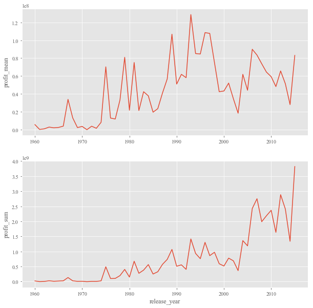

## 恭喜通过探索电影数据集! 🎉🎉

以下是一些拓展与分享, 希望对你有用

## *拓展*

- 可以在这个简单的教程了解matplotlib的作图机制 : https://www.jianshu.com/p/ec2dcd35d826
- 在合适的场景使用合适的可视化手段, 可以看这个[整理](https://datavizcatalogue.com/ZH/)
- 一个比较badass的可视化整理[博客](https://towardsdatascience.com/the-art-of-effective-visualization-of-multi-dimensional-data-6c7202990c57)
- 又一个比较badass的可视化灵感搜集[网站](https://python-graph-gallery.com/radar-chart/)

## *分享一些我的探索*

### *考察不同年份中, 不同电影类型的发行情况.*

```
# 拆分电影类型
df_genres = df.drop('genres', axis=1).join(df['genres'].str.split('|', expand=True) \
                               .stack().reset_index(level=1, drop=True).rename('genres'))
fig, axes = plt.subplots(2, 1, figsize=(20, 10))

# 为了易于辨认, 只展示部分电影类型
top5_genres = df_genres['genres'].value_counts().nlargest(5).index
btm5_genres = df_genres['genres'].value_counts().nsmallest(5).index

# 作出中位数参考线
median_cir = df_genres.groupby('release_year')['genres'].value_counts().unstack().mean(axis=1)
median_cir.plot(ax=axes[0], ls='--', label='mean', legend=True)
median_cir.plot(ax=axes[1], ls='--', label='mean', legend=True)

# 按年份作图
vis_params = {'grid': True, 'marker': 'o', 'markersize': 2, 'linewidth': 1}
df_genres[df_genres['genres'].isin(top5_genres)] \
                 .groupby('release_year')['genres'].value_counts().unstack().fillna(0) \
                 .plot(ax=axes[0], title='circulation over years of top 5 genres', **vis_params)
df_genres[df_genres['genres'].isin(btm5_genres)] \
                 .groupby('release_year')['genres'].value_counts().unstack().fillna(0) \
                 .plot(ax=axes[1], title='circulation over years of bottom 5 genres', **vis_params)

plt.tight_layout()
```

[](https://udacity-reviews-uploads.s3.us-west-2.amazonaws.com/_attachments/42601/1525327301/download.png)

### *按总收益来看, 哪些描述电影的关键字出现频率最多*

```
import matplotlib.pyplot as plt
from wordcloud import WordCloud
%config InlineBackend.figure_format = 'retina'

# organize data
factor = 'revenue_adj'
data = pd.read_csv('tmdb-movies.csv')
kw_expand = data['keywords'].str.split('|', expand=True).stack().reset_index(level=1, drop=True).rename('keywords')
df_kw_rev = data[[factor]].join(kw_expand)
word_dict = df_kw_rev.groupby('keywords')[factor].sum().to_dict()

# create wordcloud
params = {'mode': 'RGBA', 
          'background_color': 'rgba(255, 255, 255, 0)', 
          'colormap': 'Spectral'}
wordcloud = WordCloud(width=1200, height=800, **params)
wordcloud.generate_from_frequencies(word_dict)

# plot
plt.figure(figsize=(15, 10))
plt.imshow(wordcloud, interpolation='bilinear')
plt.axis('off')
```

[](https://udacity-reviews-uploads.s3.us-west-2.amazonaws.com/_attachments/42601/1526185341/download__3_.png)

### 数据导入与处理

学生成功导入所需要的库，并通过`Pandas`读取tmdb-movies.csv 中的数据。

学生成功完成 5 个 tasks。

学员对数据表中的空值进行了处理。

### 根据指定要求读取数据

完成3个简单读取的tasks

学员完成逻辑读取中的2个任务

学员使用 Groupby 命令完成2个分组读取任务

### 绘图与可视化

对 popularity 最高的20名电影绘制其 popularity 值。

分析电影净利润（票房-成本）随着年份变化的情况，并简单进行分析。

很好! 你还可以用subplots来组织mean以及sum, 你可以查看这个[subplots教程](https://www.jianshu.com/p/ec2dcd35d826)了解更多:

```
plt.style.use('ggplot')
_, axes = plt.subplots(2, 1, figsize=(10, 10))
movie_data['profit'] = movie_data['revenue'] - movie_data['budget']
target_data = movie_data.groupby('release_year')['profit'].agg(['mean', 'sum'])
axes[0].errorbar(target_data.index, target_data['mean']);
axes[1].errorbar(target_data.index, target_data['sum']);

axes[0].set_ylabel('profit_mean')
axes[1].set_ylabel('profit_sum')
axes[1].set_xlabel('release_year')
```

[](https://udacity-reviews-uploads.s3.us-west-2.amazonaws.com/_attachments/42601/1544001710/download.png)

选择最多产的10位导演（电影数量最多的），绘制他们排行前3的三部电影的票房情况，并简要进行分析。

分析1968年~2015年六月电影的数量的变化。

分析1968年~2015年六月电影 Comedy 和 Drama 两类电影的数量的变化。